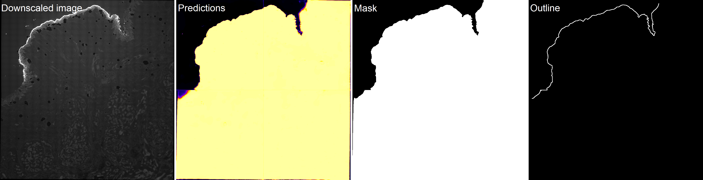
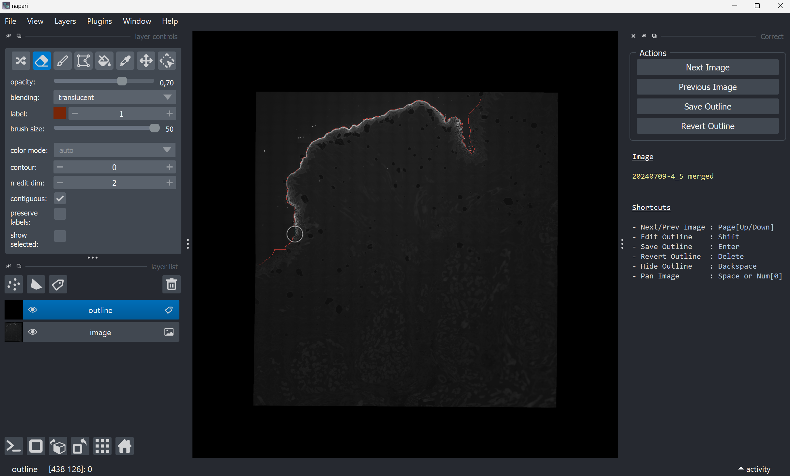
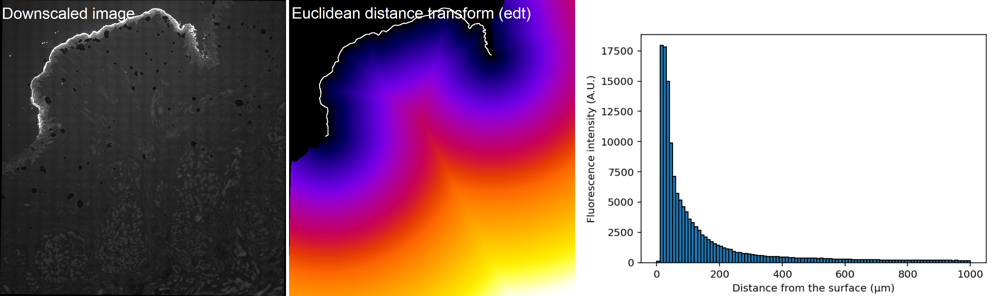

?logo=python&logoColor=rgb(149%2C157%2C165)&labelColor=rgb(50%2C60%2C65))
?logo=TensorFlow&logoColor=rgb(149%2C157%2C165)&labelColor=rgb(50%2C60%2C65))
?logo=NVIDIA&logoColor=rgb(149%2C157%2C165)&labelColor=rgb(50%2C60%2C65))
?logo=NVIDIA&logoColor=rgb(149%2C157%2C165)&labelColor=rgb(50%2C60%2C65))    
&color=rgb(149%2C157%2C165))
&color=rgb(149%2C157%2C165))
&color=rgb(149%2C157%2C165))    

# ETH-ScopeM_Krupke  
Fluorescent dye intra-tissue diffusion analysis

## Index
- [Installation](#installation)
- [Usage](#usage)
- [Comments](#comments)

## Installation

Pease select your operating system

<details> <summary>Windows</summary>  

### Step 1: Download this GitHub Repository 
- Click on the green `<> Code` button and download `ZIP` 
- Unzip the downloaded file to a desired location

### Step 2: Install Miniforge (Minimal Conda installer)
- Download and install [Miniforge](https://github.com/conda-forge/miniforge) for your operating system   
- Run the downloaded `.exe` file  
    - Select "Add Miniforge3 to PATH environment variable"  

### Step 3: Setup Conda 
- Open the newly installed Miniforge Prompt  
- Move to the downloaded GitHub repository
- Run one of the following command:  
```bash
# TensorFlow with GPU support
mamba env create -f environment_tf_gpu.yml
# TensorFlow with no GPU support 
mamba env create -f environment_tf_nogpu.yml
```  
- Activate Conda environment:
```bash
conda activate Krupke
```
Your prompt should now start with `(Krupke)` instead of `(base)`

</details> 

<details> <summary>MacOS</summary>  

### Step 1: Download this GitHub Repository 
- Click on the green `<> Code` button and download `ZIP` 
- Unzip the downloaded file to a desired location

### Step 2: Install Miniforge (Minimal Conda installer)
- Download and install [Miniforge](https://github.com/conda-forge/miniforge) for your operating system   
- Open your terminal
- Move to the directory containing the Miniforge installer
- Run one of the following command:  
```bash
# Intel-Series
bash Miniforge3-MacOSX-x86_64.sh
# M-Series
bash Miniforge3-MacOSX-arm64.sh
```   

### Step 3: Setup Conda 
- Re-open your terminal 
- Move to the downloaded GitHub repository
- Run one of the following command: 
```bash
# TensorFlow with GPU support
mamba env create -f environment_tf_gpu.yml
# TensorFlow with no GPU support 
mamba env create -f environment_tf_nogpu.yml
```  
- Activate Conda environment:  
```bash
conda activate Krupke
```
Your prompt should now start with `(Krupke)` instead of `(base)`

</details>


## Usage

### `process.py`
Read `.lif` images from `data_path` folder, process and save outputs in a new
folder named according to image name.

- Paths
```bash
- img_name         # str, image name ("all" for batch processing)
- data_path        # str, path to folder containing image(s) to process
- model_mass_path  # str, path to DL segmentation model
```

- Parameters
```bash
- df               # int, downscaling factor, should be kept at 30 (DL model)
```

- Outputs
```bash
- image.tif        # uint16, downscaled image
- prediction.tif   # float32, DL segmentation prediction
- mask.tif         # uint8, tissue segmentation mask
- outline.tif      # uint8, tissue surface mask
- metadata.txt     # df, original and downscaled pixel size in µm
- metadata.pkl     # df, original and downscaled pixel size in µm
```



### `correct.py`
Read all processed images from `data_path` and display `outline` for manual 
corrections in Napari. Erase the undesired surface and press enter to save the 
corrected `outline_hc`.

- Paths
```bash
- data_path        # str, path to folder containing image(s) to process
```

- Parameters
```bash
- erase_size       # int, size in pixel(s) of erasing tool
- paint_size       # int, size in pixel(s) of painting tool
```

- Outputs
```bash
- outline_hc.tif   # uint8, corrected tissue surface mask
```



### `analyse.py`
Read all processed images from `data_path` and compute Euclidean distance 
transform `edt` of `outline_hc` to measure fluorescence intensities according 
to the distance from the surface. If not 0, the `baseline_pc` paramater define
the percentage of lowest values that will be considered to define a baseline
to define a baseline which will be subtracted from the measured values.

- Paths
```bash
- data_path        # str, path to folder containing image(s) to process
```

- Parameters
```bash
- max_bin          # int, max bin distance in µm
- num_bins         # int, number of bins between 0 and max_bin
- baseline_pc      # float, percentage (0 to 100) of lowest values to be considered baseline
```

- Outputs
```bash
- image_bsub.tif   # float32, baseline subtracted image
- edt.tif          # float32, Euclidean distance transform of outline_hc
- display.tif      # RGB, image and outline_hc overlay 
- results.csv      # intensities acc. to distance in µm
- results.png      # plot of intensities acc. to distance in µm
- metadata.txt     # add baseline
- metadata.pkl     # add baseline
```




## Comments