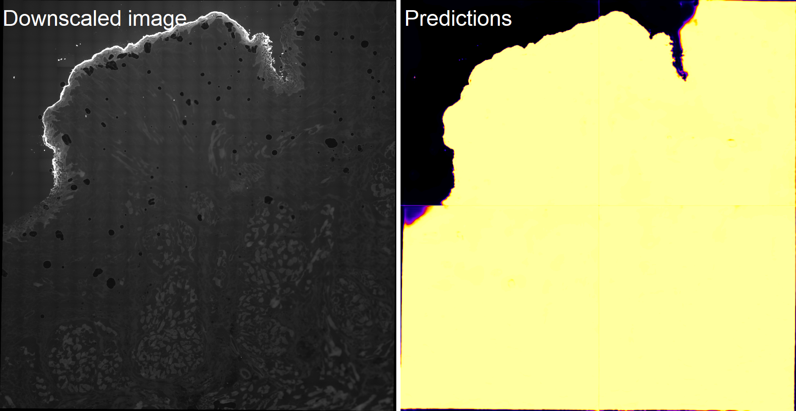
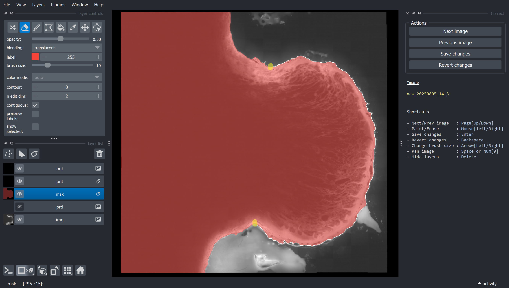
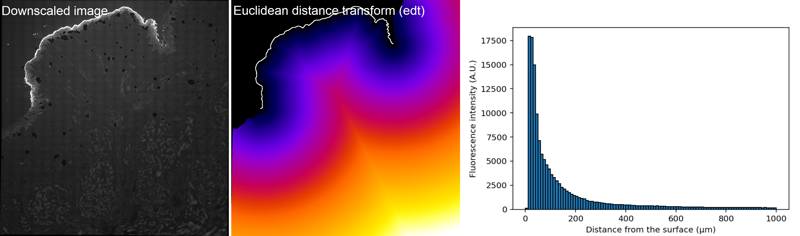

?logo=python&logoColor=rgb(149%2C157%2C165)&labelColor=rgb(50%2C60%2C65))
?logo=TensorFlow&logoColor=rgb(149%2C157%2C165)&labelColor=rgb(50%2C60%2C65))
?logo=NVIDIA&logoColor=rgb(149%2C157%2C165)&labelColor=rgb(50%2C60%2C65))
?logo=NVIDIA&logoColor=rgb(149%2C157%2C165)&labelColor=rgb(50%2C60%2C65))    
&color=rgb(149%2C157%2C165))
&color=rgb(149%2C157%2C165))
&color=rgb(149%2C157%2C165))    

# ETH-ScopeM_Krupke  
Fluorescent dye intra-tissue diffusion analysis

## Index
- [Installation](#installation)
- [Usage](#usage)
- [Comments](#comments)

## Installation

Pease select your operating system

<details> <summary>Windows</summary>  

### Step 1: Download this GitHub Repository 
- Click on the green `<> Code` button and download `ZIP` 
- Unzip the downloaded file to a desired location

### Step 2: Install Miniforge (Minimal Conda installer)
- Download and install [Miniforge](https://github.com/conda-forge/miniforge) for your operating system   
- Run the downloaded `.exe` file  
    - Select "Add Miniforge3 to PATH environment variable"  

### Step 3: Setup Conda 
- Open the newly installed Miniforge Prompt  
- Move to the downloaded GitHub repository
- Run one of the following command:  
```bash
# TensorFlow with GPU support
mamba env create -f environment_tf_gpu.yml
# TensorFlow with no GPU support 
mamba env create -f environment_tf_nogpu.yml
```  
- Activate Conda environment:
```bash
conda activate Krupke2
```
Your prompt should now start with `(Krupke2)` instead of `(base)`

</details> 

<details> <summary>MacOS</summary>  

### Step 1: Download this GitHub Repository 
- Click on the green `<> Code` button and download `ZIP` 
- Unzip the downloaded file to a desired location

### Step 2: Install Miniforge (Minimal Conda installer)
- Download and install [Miniforge](https://github.com/conda-forge/miniforge) for your operating system   
- Open your terminal
- Move to the directory containing the Miniforge installer
- Run one of the following command:  
```bash
# Intel-Series
bash Miniforge3-MacOSX-x86_64.sh
# M-Series
bash Miniforge3-MacOSX-arm64.sh
```   

### Step 3: Setup Conda 
- Re-open your terminal 
- Move to the downloaded GitHub repository
- Run one of the following command: 
```bash
# TensorFlow with GPU support
mamba env create -f environment_tf_gpu.yml
# TensorFlow with no GPU support 
mamba env create -f environment_tf_nogpu.yml
```  
- Activate Conda environment:  
```bash
conda activate Krupke2
```
Your prompt should now start with `(Krupke2)` instead of `(base)`

</details>


## Usage

### `process.py`
Read `.lif` images from `data_path` folder, downscale, predict and save outputs
in a new folder named accordingly to image name.

- Paths
```bash
- img_name      # str, image name ("all" for batch processing)
- model_name    # str, model name (saved in the repo root)
- data_path     # str, path to folder containing nd2 image(s) to process

```

- Parameters
```bash
- df            # int, downscaling factor, should be kept at 30 (DL model)
```

- Outputs
```bash
- img.tif       # uint16, downscaled image
- prd.tif       # float32, DL segmentation prediction
- metadata.txt  # df, original and downscaled pixel size in µm
- metadata.pkl  # df, original and downscaled pixel size in µm
```



### `correct.py`
Read all processed images from `data_path` and display masks (`msk`) for manual 
correction. Adjust the masks and define two points (`pnt`) to delimit the 
considered surface/outline (`out`). Make sure these two points intersect the 
surface of the mask. When finished, press `Enter` to save the corresponding 
outputs.

- Paths
```bash
- data_path  # str, path to folder containing image(s) to process
```

- Parameters
```bash
- brush_size # int, size in pixel(s) of painting/erasing tool
```

- Outputs
```bash
- msk.tif    # uint8, mask of the tissue after manual correction
- pnt.tif    # uint8, mask marking two points that delimit the considered surface/outline
- out.tif    # uint8, mask of the final considered surface/outline
```



### `analyse.py`
Read all processed images from `data_path` and compute Euclidean distance 
transform `edt` of the considered surface/outline `out` to measure fluorescence
intensities according to the distance from the surface.

- Paths
```bash
- data_path # str, path to folder containing image(s) to process
```

- Parameters
```bash
- max_bin   # int, max bin distance in µm
- num_bins  # int, number of bins between 0 and max_bin
```

- Outputs
```bash
- edt.tif   # float32, Euclidean distance transform of outline_hc
- prf.csv   # intensities (A.U.) according to distance (µm)
- fig.png   # plot of intensities (A.U.) according to distance (µm)
```




## Comments