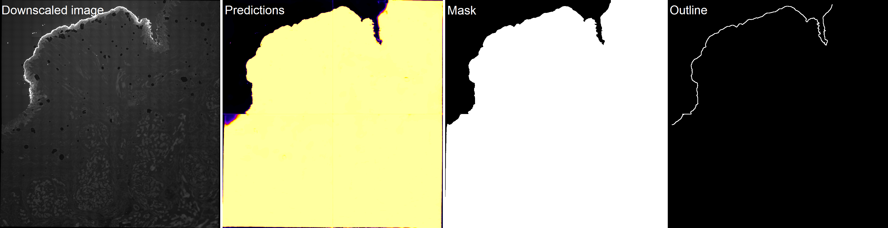
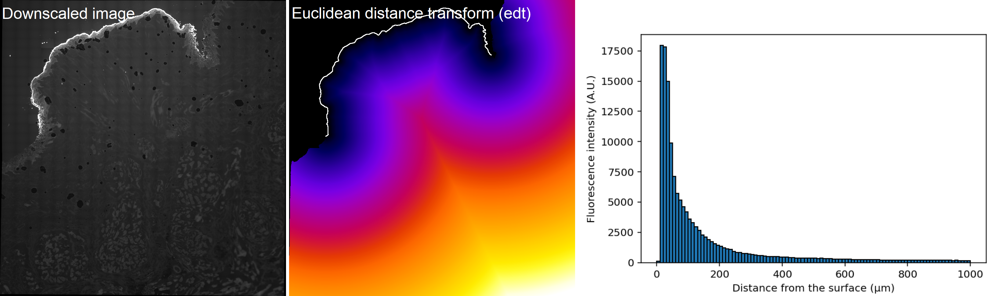

## Usage

### `process.py`
Read `.lif` images from `data_path` folder, process and save outputs in a new
folder named according to image name.

- Paths
```bash
- img_name         # str, image name ("all" for batch processing)
- data_path        # str, path to folder containing image(s) to process
- model_mass_path  # str, path to DL segmentation model
```

- Parameters
```bash
- df               # int, downscaling factor, should be kept at 30 (DL model)
```

- Outputs
```bash
- image.tif        # uint16, downscaled image
- prediction.tif   # float32, DL segmentation prediction
- mask.tif         # uint8, tissue segmentation mask
- outline.tif      # uint8, tissue surface mask
- tophat.tif       # float32, downscaled & background subtracted image
- metadata.txt     # df, original and downscaled pixel size in µm
- metadata.pkl     # df, original and downscaled pixel size in µm
```



### `correct.py`
Read all processed images from `data_path` and display `outline` for manual 
corrections in Napari. Erase the undesired surface and press enter to save the 
corrected `outline_hc`.

- Paths
```bash
- data_path        # str, path to folder containing image(s) to process
```

- Parameters
```bash
- erase_size       # int, size in pixel(s) of erasing tool
- paint_size       # int, size in pixel(s) of painting tool
```

- Outputs
```bash
- outline_hc.tif   # uint8, corrected tissue surface mask
```


### `analyse.py`
Read all processed images from `data_path` and compute Euclidean distance 
transform `edt` of `outline_hc` to measure fluorescence intensities according 
to the distance from the surface.

- Paths
```bash
- data_path        # str, path to folder containing image(s) to process
```

- Parameters
```bash
- max_bin          # int, max bin distance in µm
- num_bins         # int, number of bins between 0 and max_bin
```

- Outputs
```bash
- edt.tif          # float32, Euclidean distance transform of outline_hc
- display.tif      # RGB, image and outline_hc overlay 
- results.csv      # intensities acc. to distance in µm
- results.png      # plot of intensities acc. to distance in µm
```


